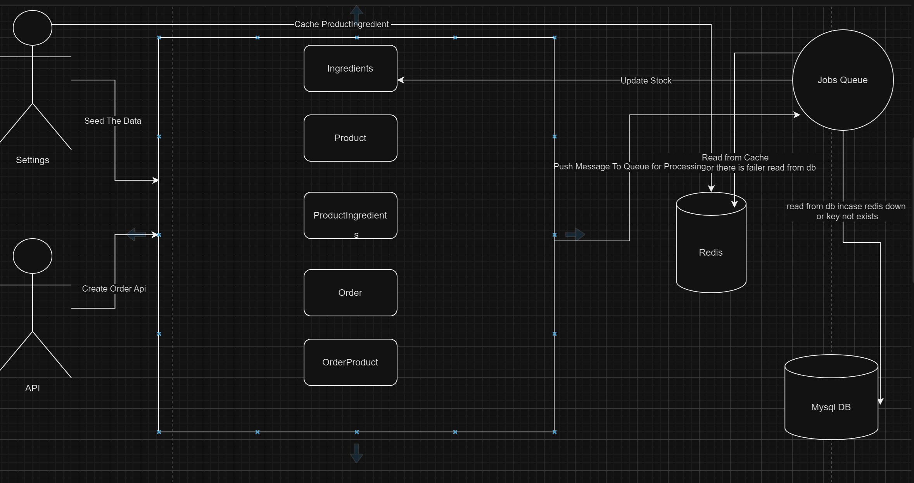

# Service Setup Guide

## Prerequisites
Ensure you have Docker and Docker Compose installed on your system.

## Step-by-Step Instructions

### 1. Start Docker Containers
Run the following command to start the Docker containers in detached mode:
```bash
docker-compose up -d
```
### 2. Access the Docker Container
```
docker exec -it foodics /bin/bash
```
### 3. Configure Environment Files
```
cp .env.example .env

cp .env.example .env.testing

add MERCHANT_EMAIL in .env 

Add Mail Configs in .env 
```
### 4. Generate Application Key
```
php artisan key:generate
```
### 5. Run Database Migrations
```
php artisan migrate
```
### 6. Seed the Database
```
php artisan db:seed
```
### 7. Start the Queue Worker
```
php artisan queue:work
```
### 8. Link Storage
```
php artisan storage:link
```
### API Endpoint
```
Create Order
To create an order, send a POST request to the following endpoint:

POST API http://localhost/api/orders
CURL Request:
curl --location 'http://localhost/api/orders' \ --header 'Accept: application/json' \ --header 'Content-Type: application/json' --data '{    "products": [ { "product_id": 1, "quantity": 26 }]}'
```
### System Design
